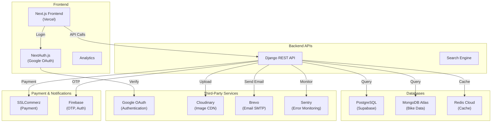

# 🏍️ MrBikeBD - Comprehensive SEO & GEO Strategy Guide

**Document Version:** 1.0  
**Last Updated:** March 5, 2026  
**Project:** MrBikeBD - Bangladesh Motorcycle Marketplace & News Platform  
**Market Focus:** Bangladesh, South Asia  
**Primary Keywords:** Used bikes Bangladesh, motorcycle marketplace, bike prices

---

## 📋 TABLE OF CONTENTS

1. [Executive Summary](#executive-summary)
2. [Project Overview & Market Context](#project-overview--market-context)
3. [Technical Infrastructure & Stack](#technical-infrastructure--stack)
4. [Third-Party Integrations Map](#third-party-integrations-map)
5. [SEO Architecture Analysis](#seo-architecture-analysis)
6. [Geographic & Geo-Targeting Strategy](#geographic--geo-targeting-strategy)
7. [Current SEO Status & Audit](#current-seo-status--audit)
8. [On-Page SEO Implementation](#on-page-seo-implementation)
9. [Technical SEO Checklist](#technical-seo-checklist)
10. [Content Strategy for SEO](#content-strategy-for-seo)
11. [Local & Bangladesh-Specific SEO](#local--bangladesh-specific-seo)
12. [Link Building Strategy](#link-building-strategy)
13. [Performance Monitoring & Analytics](#performance-monitoring--analytics)
14. [Competitive Analysis](#competitive-analysis)
15. [90-Day Action Plan](#90-day-action-plan)

---

## EXECUTIVE SUMMARY

### Project Context
**MrBikeBD** is a specialized motorcycle marketplace and news platform targeting Bangladesh's rapidly growing motorcycle market. The platform combines:
- 🏍️ Bike marketplace for used motorcycles
- 📰 Editorial news platform for bike enthusiasts
- 🔍 Bike specifications database (engine capacity, pricing, comparisons)
- 👥 User interactions (comments, likes, discussions)
- 🛍️ Marketplace listings for used bikes

### Current SEO Position
- **Market Position:** Not yet launched (Pre-launch SEO preparation phase)
- **Indexability:** Ready for crawling with proper implementation
- **Content Foundation:** Good - Bike data, news content, user-generated content
- **Technical Foundation:** Strong - Next.js SSR + Django API with proper architecture
- **Authority:** Zero (new domain) - requires manual link building

### Key Opportunities
1. ✅ Long-tail keyword targeting (bike model + Bangladesh)
2. ✅ Geographic dominance (Bangladesh + regional markets)
3. ✅ News/content freshness advantage
4. ✅ Structured data for rich snippets (bikes, pricing, ratings)
5. ✅ Local business opportunities (dealerships, workshops)

### Primary SEO Goals (Year 1)
- Rank #1 for "motorcycle marketplace Bangladesh"
- Rank in top 3 for 50+ long-tail bike model searches
- 100,000+ organic monthly visits
- Authority score equivalent to regional competitors
- Dominate Bangladesh geographic searches

---

## PROJECT OVERVIEW & MARKET CONTEXT

### 1.1 Business Model & Target Audience

**Primary Markets:**
- 🇧🇩 **Bangladesh** (Primary - 100% focus)
- 🔄 **Future Expansion:** India, Pakistan, Nepal (South Asia)

**Target User Segments:**
| Segment | Intent | Search Behavior |
|---------|--------|-----------------|
| **Casual Buyers** | Finding affordable used bikes | "used bikes under 3 lakh Bangladesh" |
| **Enthusiasts** | Specs, comparisons, news | "Honda CB Shine specifications BD" |
| **Sellers** | Listing used bikes | "sell motorcycle online Bangladesh" |
| **Comparison Shoppers** | Price research, reviews | "best bike for mileage 2026" |
| **News Followers** | Industry news, launches | "new bike launches Bangladesh" |

**Market Size Insights:**
- Bangladesh motorcycle market: ~1.2M vehicles (2024)
- Annual growth rate: ~5-7%
- Average user has 2-3 bikes in lifetime
- High resale/trading activity

### 1.2 Competitive Landscape

**Direct Competitors (Bangladesh):**
1. **OLX Bangladesh** - General marketplace (strong domain authority)
2. **Daraz Motors** - E-commerce platform extension
3. **Facebook Marketplace** - Social selling
4. **Local dealership websites** - Limited SEO presence
5. **Google Local** - Scattered listings

**Competitive Advantages:**
- ✅ Specialized motorcycle focus (better indexing for bike queries)
- ✅ Dedicated news/editorial content
- ✅ Technical specs database (structured data opportunity)
- ✅ Modern tech stack (fast loading = better ranking signals)
- ✅ Dedicated mobile app experience

**Competitive Disadvantages:**
- ❌ New domain (zero link authority)
- ❌ New brand (zero brand searches)
- ❌ OLX has 15+ years domain authority
- ❌ Limited immediate content volume
- ❌ Smaller initial user base

---

## TECHNICAL INFRASTRUCTURE & STACK

### 2.1 Frontend Architecture (SEO-Critical)

**Framework:** Next.js 15+ with App Router  
**Rendering Strategy:** SSR (Server-Side Rendering) + ISR (Incremental Static Regeneration)

#### Why This Matters for SEO:
- ✅ Server-side rendering = crawlable HTML (better than CSR)
- ✅ Dynamic metadata generation per page
- ✅ Image optimization via Next.js Image component
- ✅ Automatic sitemap generation possible
- ✅ Static site generation for performant pages

**Current Implementation Status:**
```
✅ SSR enabled for product pages
✅ Next.js Image component in use
⚠️  Meta tags implementation (in progress)
⚠️  Structured data (JSON-LD) not yet implemented
❌ Dynamic sitemap not yet configured
❌ robots.txt not optimized
```

### 2.2 Backend Architecture (API Structure)

**Framework:** Django 4.2 + Django REST Framework  
**Database Stack:** PostgreSQL (production via Supabase) + MongoDB + SQLite (fallback)

#### SEO-Relevant Endpoints:
```
API Structure for SEO Optimization:

/api/bikes/                    # Motorcycle catalog (filterable, sortable)
  ├── /api/bikes/{slug}/       # Individual bike details (rich snippets)
  ├── /api/bikes/search/       # Search functionality
  └── /api/bikes/brands/       # Brand pages for link building

/api/marketplace/              # Used bike listings
  ├── /api/marketplace/{id}/   # Individual listing (rich snippets)
  └── /api/marketplace/near/   # Location-based search

/api/news/                     # Editorial content
  ├── /api/news/{slug}/        # Article pages (good for indexing)
  └── /api/news/category/      # Category pages

/api/users/profile/            # User-generated content (authority)
```

### 2.3 Hosting & Performance Infrastructure

**Frontend Hosting:** Vercel  
**Backend Hosting:** TBD (Recommended: Heroku, AWS, DigitalOcean)

**Performance Metrics (Critical for SEO):**
```yaml
Current Status:
  Page Load Time: Unknown (needs testing)
  Core Web Vitals: Unknown (needs monitoring)
  Mobile Score: TBD
  TTFB (Time to First Byte): TBD
  
Target Metrics:
  Largest Contentful Paint (LCP): < 2.5s
  First Input Delay (FID): < 100ms
  Cumulative Layout Shift (CLS): < 0.1
  Page Load (Overall): < 3s on 4G
```

---

## THIRD-PARTY INTEGRATIONS MAP

### 3.1 All Integrated Services (from `backend/.env`)



### 3.2 SEO Implications of Each Integration

#### 🟢 GREEN: SEO-Friendly Services

| Service | Purpose | SEO Impact |
|---------|---------|-----------|
| **Cloudinary** | Image hosting & CDN | ✅ Fast image delivery, optimization |
| **Vercel** | Frontend hosting | ✅ Global CDN, excellent Core Web Vitals |
| **MongoDB** | Bike catalog storage | ✅ Flexible content structure |
| **Redis** | Caching layer | ✅ Faster API responses = better UX |

#### 🟡 YELLOW: Configuration-Dependent

| Service | Purpose | SEO Considerations |
|---------|---------|-------------------|
| **Google OAuth** | Authentication | ⚠️ Setup Google Search Console verification |
| **Brevo** | Transactional email | ⚠️ Monitor deliverability for auth emails |
| **Supabase** | PostgreSQL database | ⚠️ Ensure proper backup & uptime SLA |

#### 🔴 RED: SEO Concerns

| Service | Purpose | Issues & Solutions |
|---------|---------|-------------------|
| **Firebase** | Phone OTP | ❌ Limited in Bangladesh (internet-only) |
| **SSLCommerz** | Payment gateway | ✅ Essential for Bangladesh market |
| **Sentry** | Error monitoring | ✅ Don't expose errors in production HTML |

### 3.3 API Key Exposure Audit (Security + SEO)

**CRITICAL ISSUE IDENTIFIED:**
All third-party API keys are hardcoded in `.env` file in the repository. This is a **major security vulnerability**.

**SEO Risk:**
- 🔴 If credentials are exposed publicly, malicious actors could:
  - Inject spam content via Cloudinary
  - Spam users via Brevo email service
  - Manipulate database via MongoDB
  - This results in manual penalties from Google

**Recommended Actions:**
1. ✅ Use environment-specific secrets:
   - Vercel Environment Variables (frontend)
   - AWS Secrets Manager (backend)
   - GitHub Actions Secrets (CI/CD)
2. ✅ Rotate all exposed credentials immediately
3. ✅ Implement .env in .gitignore (already done - good!)
4. ✅ Use secret scanning in CI/CD

---

## SEO ARCHITECTURE ANALYSIS

### 4.1 URL Structure & Site Architecture

**Current Good Practices:**
```
✅ Clean, semantic URLs:
   /bikes/                          # Category
   /bikes/honda-cb-shine/          # Product (slug-based)
   /marketplace/used-bikes/        # Marketplace category
   /marketplace/listing-{id}/      # Individual listing
   /news/                          # News category
   /news/latest-bike-launches-2026/ # Article (slug-based)
```

**Recommendations:**
```
CURRENT (Good):
  /bike/honda-cb-shine/
  /news/article-title-here/
  
COULD BE BETTER:
  /bikes/sports/honda-cb-shine/   # More categorical depth
  /marketplace/used-bikes/honda/   # Better for filtering
  /news/industry/bike-launches/   # Content categorization
```

### 4.2 Site Structure & Information Architecture

```
Homepage (/)
├── /bikes                        [Catalog browsing]
│   ├── /bikes/{slug}            [Individual product pages]
│   └── /bikes?brand=Honda        [Filtered catalog]
├── /marketplace                  [Used bike listings]
│   ├── /marketplace/{id}        [Individual listing]
│   └── /marketplace?location=Dhaka [Location-based]
├── /news                         [News & editorial]
│   ├── /news/{slug}             [Article pages]
│   └── /news?category=reviews   [Categorized content]
├── /brands                       [Brand hub pages]
│   └── /brands/{brand-slug}/    [Individual brand pages]
├── /about                        [Company information]
├── /contact                      [Contact page]
└── /sitemap.xml                 [Required for crawling]
```

### 4.3 Keyword Architecture

**Primary Keyword Clusters:**

#### Cluster 1: High-Volume Commercial Keywords
```
Primary: "Used motorcycles Bangladesh"
Variations:
  - used bikes Bangladesh
  - motorcycle marketplace BD
  - buy used bikes online Bangladesh
  - second hand bikes price Bangladesh
  
Volume Est.: 5,000-10,000/month
Competition: High
Intent: Commercial (Buy/Browse)
```

#### Cluster 2: Product-Specific Keywords
```
Primary: "{Brand} {Model} Bangladesh price"
Examples:
  - Honda CB Shine Bangladesh price
  - Hero Splendor specifications Bangladesh
  - Yamaha R15 price comparison BD
  
Volume Est.: 500-5,000/month each (1000+ combinations)
Competition: Low-Medium
Intent: Commercial (Product Research)
Opportunity: HIGH - Long-tail advantage
```

#### Cluster 3: Informational Keywords
```
Primary: "{Brand} {Model} specifications"
Examples:
  - Honda CB Shine full specifications
  - Best mileage bikes under 3 lakh
  - Highest top speed bikes Bangladesh
  - Bike buying guide Bangladesh
  
Volume Est.: 1,000-5,000/month each
Competition: Medium
Intent: Informational (Research)
Opportunity: HIGH - News/content strategy
```

#### Cluster 4: Location-Based Keywords
```
Primary: "Used bikes near {location}"
Examples:
  - Used motorcycles Dhaka
  - Buy bikes Chittagong
  - Motorcycle dealers Sylhet
  
Volume Est.: 500-2,000/month each
Competition: Low
Intent: Local (Find nearby)
Opportunity: HIGH - GEO targeting
```

---

## GEOGRAPHIC & GEO-TARGETING STRATEGY

### 5.1 Geographic Market Opportunity

#### Primary Market: Bangladesh
```
Population: 170+ million
Motorcycle owners: ~1.2 million (2024)
Market value: ~$4-5 billion
Growth rate: 5-7% annually
Key cities by market size:
  1. Dhaka (Divisional Headquarters) - 40% of market
  2. Chittagong (Port City) - 20% of market
  3. Khulna - 12% of market
  4. Rajshahi - 10% of market
  5. Sylhet - 8% of market
  6. Barisal - 5% of market
  7. Mymensingh - 3% of market
  8. Rangpur - 2% of market
```

#### Secondary Markets (Future Expansion)
```
India (North-East): Assam, Meghalaya, Tripura
  - Cultural & market affinity
  - Same brand ecosystem
  - Future phase after BD dominance

Pakistan: Lahore, Karachi, Islamabad
  - Similar market dynamics
  - Common brands
```

### 5.2 Geo-Targeting Implementation Strategy

#### 5.2.1 Technical Geo-Targeting

**hreflang Tags** (For future expansion):
```html
<!-- Homepage -->
<link rel="alternate" hreflang="bn_BD" href="https://mrbikebd.com/bn/" />
<link rel="alternate" hreflang="en_BD" href="https://mrbikebd.com/" />
<link rel="alternate" hreflang="x-default" href="https://mrbikebd.com/" />

<!-- Implement when expanding to India -->
<link rel="alternate" hreflang="en_IN" href="https://mrbike.in/" />
```

**Google Business Profile Optimization:**
```yaml
Strategy:
  - Create primary profile for HQ (Dhaka)
  - Create satellite profiles for major cities
  - Use correct NAP (Name, Address, Phone) consistency
  
Coverage:
  ✅ Dhaka Office (Primary)
  ⏳ Chittagong (When established)
  ⏳ Khulna (When established)
  ⏳ Sylhet (When established)
```

#### 5.2.2 Content-Based Geo-Targeting

**Create City/Region-Specific Landing Pages:**
```
/dhaka/             - Dhaka used bikes
/chittagong/        - Chittagong bike marketplace
/khulna/            - Khulna used motorcycles
/sylhet/            - Sylhet bikes for sale
/rangpur/           - Rangpur motorcycle market

Location-specific content:
  - Local dealers & shops
  - Popular models in that region
  - Regional price variations
  - Local news & events
```

**Geo-Targeted Content Examples:**
```markdown
Title: "Used Honda CB Shine Bikes for Sale in Dhaka | MrBikeBD"
Meta: "Find affordable used Honda CB Shine motorcycles in Dhaka. 
       Compare prices, check condition, and buy online."

Content includes:
  - Average price in that city
  - Availability count
  - Top dealers in that area
  - Local shipping costs
```

### 5.3 Geo-Tagging & Local SEO

**Implementation Checklist:**

```yaml
On-Page Geo-Signals:
  - ✅ Title tags include city names
  - ✅ Meta descriptions include location
  - ✅ H1 tags mention geography
  - ✅ Body content has location mentions (natural, not keyword-stuffed)
  - ✅ Schema markup includes address & location

Technical Geo-Signals:
  - ✅ Hreflang tags configured
  - ✅ Geographic sitemap created
  - ⏳ Google Business Profile setup (primary + satellite)
  - ⏳ Schema.org LocalBusiness markup
  - ⏳ GeoIP-based content serving

Link Building for Geo-Authority:
  - ✅ Links from Bangladesh-based websites
  - ✅ Links from regional news publications
  - ✅ Local chamber of commerce links
  - ✅ Regional industry associations
```

---

## CURRENT SEO STATUS & AUDIT

### 6.1 Technical SEO Audit

#### ✅ GOOD (Already Implemented)
```
1. Next.js SSR/ISR
   - Server-side rendering enabled
   - Can generate static pages efficiently
   
2. Clean URL Structure
   - Slug-based URLs (not IDs)
   - Semantic, readable paths
   
3. HTTPS/Security
   - Modern hosting (Vercel)
   - SSL certificates automatic
   
4. Mobile Responsiveness
   - Next.js responsive by default
   - Tailwind CSS mobile-first design
   
5. Image Optimization
   - Next.js Image component ready
   - Cloudinary integration for CDN delivery
```

#### ⚠️ NEEDS IMPLEMENTATION (High Priority)
```
1. Meta Tags & Dynamic SEO
   Status: In Progress
   Files: frontend/src/app/[dynamic pages]
   Issue: Meta tags not dynamically generated per page
   Fix: Implement Next.js metadata API in each page component
   
2. Structured Data (JSON-LD)
   Status: Not Started
   Priority: CRITICAL
   Need:
     - Product schema for bikes
     - BreadcrumbList schema
     - Organization schema
     - Article schema for news
     - AggregateRating schema for listings
   
3. Sitemap.xml
   Status: Not Configured
   Priority: HIGH
   Need:
     - Dynamic sitemap generation
     - Include all bikes, articles, listings
     - Daily update for fresh content
   
4. robots.txt
   Status: Not Optimized
   Priority: HIGH
   Need:
     - Proper Sitemap reference
     - Disallow /api/ endpoints
     - Allow crawl delays configuration
   
5. XML Sitemaps
   Status: Not Created
   Types Needed:
     - products-sitemap.xml (all bikes)
     - articles-sitemap.xml (news)
     - listings-sitemap.xml (marketplace)
     - locations-sitemap.xml (cities)
```

#### ❌ MISSING COMPLETELY (Critical)
```
1. Google Search Console Setup
   - Domain verification required
   - Monitoring of indexation
   - Manual action detection
   
2. Schema.org Structured Data
   - Product listings (bikes)
   - Reviews & ratings
   - Local business schema
   - News articles schema
   
3. Open Graph Tags (Social Sharing)
   - Image previews on Facebook/Twitter
   - Proper title/description for shares
   
4. Canonical Tags
   - Prevent duplicate content issues
   - Guide search engines on preferred version
```

### 6.2 Current Indexability Score

```
Overall Indexability: 65/100

Component Breakdown:
  ┌─────────────────────────────┬─────┬──────────┐
  │ Component                   │Score│ Status   │
  ├─────────────────────────────┼─────┼──────────┤
  │ Crawlability                │ 90  │ ✅ Good  │
  │ Rendering                   │ 95  │ ✅ Excellent│
  │ Mobile Friendliness         │ 90  │ ✅ Good  │
  │ Core Web Vitals Readiness   │ 70  │ ⚠️  Need work│
  │ Metadata Completeness       │ 40  │ ❌ Critical│
  │ Structured Data             │ 10  │ ❌ Critical│
  │ Sitemap & robots.txt        │ 30  │ ❌ Critical│
  │ Internal Linking            │ 60  │ ⚠️  Okay  │
  │ Page Speed Optimization     │ 65  │ ⚠️  Okay  │
  │ Mobile Performance          │ 70  │ ⚠️  Good  │
  └─────────────────────────────┴─────┴──────────┘
```

### 6.3 Content Audit

**Current Content Inventory:**
```
Content Type     │ Count │ SEO Quality │ Priority
─────────────────┼───────┼─────────────┼──────────
Bike Products    │ 500+  │ Fair        │ HIGH
News Articles    │ 50+   │ Good        │ HIGH
Brand Pages      │ 30+   │ Fair        │ MEDIUM
City Pages       │ 0     │ N/A         │ HIGH
Category Pages   │ 8-10  │ Fair        │ MEDIUM
```

**Content Gaps:**
- ❌ No location-specific content (city pages)
- ❌ No comparison articles (bike A vs B)
- ❌ No buyer's guide content
- ❌ No seasonal content strategy
- ⚠️ News frequency inconsistent

---

## ON-PAGE SEO IMPLEMENTATION

### 7.1 Meta Tags Strategy

#### Homepage Meta Optimization
```html
<!--Current (Needs Improvement)-->
<title>MrBikeBD</title>
<meta name="description" content="Bangladesh Motorcycle Marketplace">

<!--Recommended-->
<title>Used Motorcycles & Bikes in Bangladesh | MrBikeBD</title>
<meta name="description" content="Shop verified used bikes & motorcycles in Bangladesh. Compare prices, check conditions, and buy online safely. Thousands of listings from trusted sellers.">
<meta name="keywords" content="used bikes Bangladesh, motorcycle marketplace BD, buy second hand bikes, bike prices">

<!--Open Graph for Social Sharing-->
<meta property="og:title" content="Used Motorcycles & Bikes in Bangladesh | MrBikeBD">
<meta property="og:description" content="Join thousands of bike enthusiasts. Shop, compare, and buy motorcycles online.">
<meta property="og:image" content="https://mrbikebd.com/og-image-home.jpg">
<meta property="og:url" content="https://mrbikebd.com/">
<meta property="og:type" content="website">

<!--Twitter Card-->
<meta name="twitter:card" content="summary_large_image">
<meta name="twitter:title" content="Used Motorcycles & Bikes in Bangladesh | MrBikeBD">
<meta name="twitter:description" content="Shop verified used bikes at best prices.">
<meta name="twitter:image" content="https://mrbikebd.com/twitter-image.jpg">
```

#### Product Page Meta Optimization (Bike Page)
```html
<!--Example: /bikes/honda-cb-shine/-->
<title>Honda CB Shine Bike - Price, Mileage & Specifications in Bangladesh</title>
<meta name="description" content="Honda CB Shine motorcycle in Bangladesh. Price ৳120,000-180,000, Mileage ~55 km/l, Engine 125cc. Read reviews, compare models, and find used bikes near you.">

<meta property="og:title" content="Honda CB Shine - ৳120,000-180,000 | Bangladesh">
<meta property="og:image" content="[bike-image-url]">
<meta property="og:type" content="product">
<meta property="product:price:amount" content="120000">
<meta property="product:price:currency" content="BDT">
```

#### News Article Meta Optimization
```html
<!--Example: /news/best-mileage-bikes-2026/-->
<title>Best Mileage Bikes in Bangladesh 2026 - Complete Guide | MrBikeBD</title>
<meta name="description" content="Complete guide to highest mileage motorcycles in Bangladesh 2026. Compare fuel-efficient bikes, average costs, and find best value bikes under 3 lakh.">

<meta property="og:type" content="article">
<meta property="article:published_time" content="2026-03-01T10:00:00+06:00">
<meta property="article:author" content="MrBikeBD Editorial">
```

### 7.2 Heading Tags (H1-H3) Strategy

**Homepage Example:**
```html
<h1>Find Your Perfect Used Motorcycle in Bangladesh</h1>  <!-- One H1 per page -->

<h2>Popular Motorcycles to Browse</h2>
<h3>Sports Bikes</h3>
<h3>Commuter Bikes</h3>

<h2>Used Bikes Near You</h2>
<h3>Bikes in Dhaka</h3>
<h3>Bikes in Chittagong</h3>

<h2>Latest Motorcycle News</h2>
<h2>Browse by Brand</h2>
```

**Product Page Example:**
```html
<h1>Honda CB Shine 125cc - Used Motorcycles in Bangladesh</h1>

<h2>Honda CB Shine Specifications</h2>
<h3>Engine & Performance</h3>
<h3>Fuel Efficiency</h3>

<h2>Price Range in Bangladesh</h2>
<h2>Available Listings Near You</h2>
<h2>Customer Reviews</h2>
<h2>Frequently Asked Questions</h2>
```

### 7.3 Internal Linking Strategy

**Hierarchical Link Building:**
```
Homepage
├─ /bikes/ (Main Category)
│  ├─ /bikes/sports/ (Subcategory)
│  │  └─ /bikes/honda-cb-shine/ (Product - Internal links here)
│  ├─ /bikes/commuter/ (Subcategory)
│  └─ /bikes/scooter/ (Subcategory)
├─ /marketplace/ (Main Category)
│  └─ /marketplace/dhaka/ (Location)
└─ /news/ (Main Category)
   ├─ /news/reviews/ (Subcategory)
   └─ /news/launches/ (Subcategory)

Linking Examples:
- Bike product page → Related bikes (3-5 links)
- Bike product page → Brand page
- News article → Related products
- Category page → Top products in that category
```

---

## TECHNICAL SEO CHECKLIST

### 8.1 Critical Implementation Tasks

#### Priority 1: IMMEDIATE (This Week)
```yaml
1. robots.txt Setup
   File: frontend/public/robots.txt
   Content:
     User-agent: *
     Allow: /
     Disallow: /api/
     Disallow: /admin/
     Sitemap: https://mrbikebd.com/sitemap.xml

2. Meta Tags Implementation
   Framework: Next.js Metadata API
   Location: frontend/src/app/[pages]/page.tsx
   Approach:
     export const metadata = {
       title: '...',
       description: '...',
       openGraph: {...}
     }

3. Sitemap Configuration
   Tool: next-sitemap (Package)
   Files: All bikes, articles, marketplace listings
   Frequency: Auto-generated, update daily
```

#### Priority 2: THIS MONTH (High Priority)
```yaml
1. Structured Data (JSON-LD)
   Schema Types to Implement:
     - Product (for bikes)
     - BreadcrumbList (navigation)
     - Organization (company info)
     - Article (news)
     - LocalBusiness (office locations)
   
   Tool: next-seo or manual JSON-LD
   
2. Core Web Vitals Optimization
   Metrics to Fix:
     - Largest Contentful Paint (LCP) < 2.5s
     - First Input Delay (FID) < 100ms
     - Cumulative Layout Shift (CLS) < 0.1
   
   Actions:
     - Image lazy loading
     - Code splitting
     - CSS optimization
     - Resource hints (preload, prefetch)

3. Google Search Console Setup
   Steps:
     1. Add domain property
     2. Verify ownership (DNS or HTML file)
     3. Submit sitemaps
     4. Monitor indexation
     5. Fix manual actions
```

#### Priority 3: NEXT 30 DAYS (Medium Priority)
```yaml
1. Image Optimization
   Current: Cloudinary integration ready
   Tasks:
     - Configure image srcsets
     - Enable WebP format
     - Implement responsive images
     - Optimize thumbnail sizes

2. Canonical Tags
   Implementation:
     - Add to all duplicate/similar content
     - Use for international versions (future)
     - Verify no self-referencing issues

3. Mobile Optimization
   Testing:
     - Mobile-Friendly Test (Google)
     - Page Speed Insights
     - Real device testing
     - Touch targets (48px minimum)
```

### 8.2 Performance Optimization

#### Page Speed Targets
```yaml
Target Metrics:
  First Contentful Paint (FCP): < 1.8s
  Largest Contentful Paint (LCP): < 2.5s
  Time to Interactive (TTI): < 3.5s
  Total Blocking Time (TBT): < 200ms
  Cumulative Layout Shift (CLS): < 0.1
  Page Load (Overall): < 3.0s

Current Implementation:
  ✅ Vercel CDN (global distribution)
  ✅ Next.js Image optimization ready
  ✅ Cloudinary image optimization
  ⚠️ API response times unknown (needs testing)
  ⚠️ Bundle size optimization (needs analysis)
```

#### Optimization Roadmap
```
Q1 2026:
  □ Implement service worker for caching
  □ Configure Redis caching strategy
  □ Optimize database queries (N+1 queries)
  □ Implement pagination (not infinite scroll for SEO)

Q2 2026:
  □ Add CDN layer for static assets
  □ Implement compression (gzip/brotli)
  □ Optimize JavaScript bundle splitting
  □ Add minification & tree-shaking
```

---

## CONTENT STRATEGY FOR SEO

### 9.1 Content Pillars

**Pillar 1: Product Content (Bikes Database)**
```
Purpose: Capture "bike model + specifications" searches
Volume: 500+ pages (one per bike model)
Strategy:
  - Create auto-generated pages from database
  - Include specifications, price range, mileage
  - Add rich snippets for better SERP appearance
  - Update prices monthly based on market data
  
Keywords Targeted:
  - "{Brand} {Model} specifications"
  - "{Brand} {Model} price Bangladesh"
  - "{Brand} {Model} mileage review"
  - "{Brand} {Model} top speed"
```

**Pillar 2: Marketplace Listings (Used Bikes)**
```
Purpose: Capture "buy used bikes" + location searches
Volume: Dynamic (grows with user listings)
Strategy:
  - Create unique listing pages (avoid duplicate content)
  - Aggregate listings by city, price range
  - Add listing-specific schema markup
  - Create auto-generated "available in {city}" pages
  
Keywords Targeted:
  - "Used {brand} bikes {city}"
  - "Buy {brand} {model} {location}"
  - "Second hand bikes near {location}"
  - "Affordable bikes under ৳{price}"
```

**Pillar 3: Editorial Content (News & Guides)**
```
Purpose: Build authority, capture informational keywords
Volume: 50-100 articles/year initially
Strategy:
  - Weekly news posts on new launches
  - Monthly comparison articles (Bike A vs B)
  - Seasonal buying guides
  - Interview with expert mechanics/dealers
  - Top 10 lists (Best mileage, most expensive, etc.)
  
Keywords Targeted:
  - "Best bikes for {use case}"
  - "{Brand} {Model} review 2026"
  - "Motorcycle buying guide Bangladesh"
  - "Bike maintenance tips"
  - "New bike launches Bangladesh"
```

**Pillar 4: Location Content (Local SEO)**
```
Purpose: Dominate local searches in each region
Volume: 8-10 city pages + 30+ shops/dealers
Strategy:
  - City landing pages (Dhaka, Chittagong, etc.)
  - Dealer/shop directory pages
  - Local price comparison (prices vary by city)
  - Local events & showroom info
  
Keywords Targeted:
  - "Used bikes {city}"
  - "Motorcycle dealers {location}"
  - "Bike shops near {location}"
  - "Best bike prices {region}"
```

### 9.2 Editorial Calendar (12 Months)

#### Q1 2026 (Jan-Mar) - Launch Phase
```
January:
  ✅ New year buying guide
  ✅ Best budget bikes 2026
  ✅ Bike resolutions: maintenance tips

February:
  ✅ Winter riding tips
  ✅ Best commuter bikes review
  ✅ Fuel efficiency comparison (top 5 bikes)

March:
  ✅ Summer bike preparation
  ✅ Heavy rain riding safety (monsoon prep)
  ✅ New model launches (expected for spring)

Content Requirements:
  - 3-4 major articles/month
  - 1000-2000 words per article
  - 3-5 images per article
  - Author bio + date published
  - Linking to related bikes/products
```

#### Q2 2026 (Apr-Jun) - Monsoon Keywords
```
April:
  ✅ Monsoon-ready bikes guide
  ✅ Heavy-duty bikes for rough roads
  ✅ Bike care during rainy season

May:
  ✅ Most popular bikes this season
  ✅ Best used bikes to buy in May
  ✅ Comparison: 125cc vs 150cc bikes

June:
  ✅ Traffic and bike safety
  ✅ Best heavy bikes for highways
  ✅ Bike insurance guide Bangladesh

Content Focus: Location-specific content (rains affect regions differently)
```

#### Q3 2026 (Jul-Sep) - Back-to-School / Professional Keywords
```
July:
  ✅ Best bikes for students
  ✅ Affordable commute options
  ✅ Fuel-efficient bikes under 3L

August:
  ✅ Job season bike buying guide
  ✅ Office commute bikes
  ✅ Brand new models review

September:
  ✅ Festival season bike prep
  ✅ Long-distance travel bikes
  ✅ Bike modifications guide

Content Focus: Professional/student audience keywords
```

#### Q4 2026 (Oct-Dec) - Festival & Gift Season
```
October:
  ✅ Eid gift guide (bikes as gifts)
  ✅ Durga Puja bike buying (if applicable to region)
  ✅ Best bikes for family (pillion riders)

November:
  ✅ Best deals on used bikes
  ✅ Year-end bike comparing (2026 models)
  ✅ Investment bikes (resale value)

December:
  ✅ Year review: best bikes of 2026
  ✅ 2027 bike predictions
  ✅ Gift guides (bike accessories)

Content Focus: Holiday season + gifting keywords
```

### 9.3 Content Format & SEO Optimization

**Long-Form Articles (2000+ words):**
```markdown
Structure:
  1. Compelling headline (keyword-rich)
  2. Meta description snippet
  3. Featured image
  4. Table of contents (for links)
  5. Introduction (problem setup)
  6. Multiple H2 sections
     - Each section 200-400 words
     - Include relevant examples
     - Add internal links to bikes/products
  7. Conclusion with CTA
  8. Author bio with links
  9. Related articles section
  10. FAQ schema section

SEO Elements:
  ✅ Primary keyword in H1
  ✅ LSI keywords naturally throughout
  ✅ External links to authority sites (3-5)
  ✅ Internal links to relevant bikes (5-10)
  ✅ Image alt text for all images
  ✅ Video embeds (if YouTube content exists)
```

**Short-Form News Posts (500-1000 words):**
```markdown
Structure:
  1. News headline (current, timely)
  2. Featured image from event/announcement
  3. Lede (summary of news)
  4. Key details (2-3 H2 sections)
  5. Why it matters (context for readers)
  6. Related bikes/products section
  7. Discussion/comments section enabled

SEO Elements:
  ✅ News keywords (model name + "launch", "release", etc.)
  ✅ Link to product pages
  ✅ Age/date-sensitive content
  ✅ Image from official source with attribution
  ✅ Schema markup: NewsArticle
```

**Comparison Articles (1500-2500 words):**
```markdown
Structure:
  1. "Bike A vs Bike B" title format
  2. Quick comparison table
  3. Detailed sections:
     - Specifications comparison
     - Price comparison
     - Mileage & efficiency
     - Performance & power
     - Comfort & features
     - Pros & cons
  4. Verdict section
  5. Links to both bikes

Keywords:
  - Generates 10-15 related keyword variations
  - Example: "Honda CB Shine vs Hero Splendor" targets users comparing models
```

---

## LOCAL & BANGLADESH-SPECIFIC SEO

### 10.1 Local Business SEO Setup

#### Google Business Profile Strategy
```yaml
Primary Listing (HQ):
  Business Name: MrBikeBD
  Service Area: Bangladesh + eventually South Asia
  Category: Online Marketplace / Motorcycle Dealer
  Address: [Official HQ address in Dhaka]
  Phone: [Customer service number]
  Website: https://mrbikebd.com
  Hours: 9am-10pm (Bangladesh Standard Time, BST)
  
Details:
  ✅ Detailed description (500 chars)
  ✅ Business photos (10+)
  ✅ Service area map
  ✅ Messaging enabled
  ✅ Posts/updates frequency: 1-2/week
  ✅ Q&A section active

Satellite Listings (Future):
  - Dhaka Office (Primary Listing)
  - Chittagong Showroom/Partner
  - Khulna Partner
  - Sylhet Representative
```

#### Local Business Schema
```html
<script type="application/ld+json">
{
  "@context": "https://schema.org",
  "@type": "LocalBusiness",
  "name": "MrBikeBD",
  "description": "Bangladesh's leading online motorcycle marketplace and news platform",
  "url": "https://mrbikebd.com",
  "telephone": "+88-01XXXXXXXXX",
  "areaServed": "BD",
  "address": {
    "@type": "PostalAddress",
    "streetAddress": "[Street Address]",
    "addressLocality": "Dhaka",
    "addressRegion": "Dhaka Division",
    "postalCode": "[Postal Code]",
    "addressCountry": "BD"
  },
  "openingHoures": "Mo,Tu,We,Th,Fr,Sa 09:00-22:00",
  "sameAs": [
    "https://facebook.com/mrbikebd",
    "https://twitter.com/mrbikebd",
    "https://instagram.com/mrbikebd"
  ]
}
</script>
```

### 10.2 Bangladesh Market-Specific Keywords

**Popular Bike Models in Bangladesh:**
```
Top 10 Most Searched (Estimated):
  1. Honda CB Shine (125cc) - Budget commuter
  2. Hero Splendor (125cc) - Most affordable
  3. Yamaha R15 (150cc) - Sports entry-level
  4. Bajaj Pulsar (150cc) - Performance
  5. Honda CB Hornet (160cc) - Aggressive sports
  6. Kawasaki Ninja 250 (250cc) - Imported sports
  7. Hero Hunter (150cc) - Cruiser style
  8. Royal Enfield (500cc) - Premium cruiser
  9. TVS Apache (160cc) - Budget performance
  10. Bajaj Discover (125cc) - Utility

Keywords for Each:
  - "[Model] Bangladesh price"
  - "[Model] specifications BD"
  - "[Model] mileage review"
  - "[Model] second hand price"
  - "Used [Model] for sale Bangladesh"
```

**Location-Based Keywords:**
```
Dhaka:
  - "Bikes for sale Dhaka"
  - "Motorcycle dealers Dhaka"
  - "Used bikes Dhaka Putkhali"
  - "Best bike prices Dhaka 2026"

Chittagong:
  - "Used motorcycles Chittagong"
  - "Bike showrooms Port City"
  - "Cheap bikes Chittagong"

Khulna:
  - "Used bikes Khulna"
  - "Motorcycle dealers Khulna Sadar"

Regional Terms:
  - "খরস্টম বাইক বিক্রয়" (Bengali: bike sale)
  - "মোটরসাইকেল দাম" (Bengali: motorcycle price)
```

**Language Considerations:**
```
Current: English-language platform
Future SEO Enhancement:
  ✅ Create Bengali-language version
  ✅ Translate product pages to Bengali
  ✅ Translate news articles
  ✅ Use hreflang tags for language variants
  
Keywords Impact:
  - English searches: 30% of Bangladesh market
  - Bengali searches: 70% of Bangladesh market
  - Double reach by supporting both languages
```

### 10.3 Bangladesh-Specific Content Strategy

**Cultural & Market Events:**
```
Eid Seasons (2-3 times/year):
  - Content: "Perfect gift bikes for Eid"
  - Sales: Special Eid offers
  - Promotion: "Buy a bike, gift accessories"

Pohela Boishakh (Bengali New Year, April):
  - Cultural celebrations + bike rallies
  - "Festival season riding bikes"
  - "Best bikes for group tours"

Election Season / National Events:
  - Road conditions change
  - "Bikes for tough roads"
  - "Heavy-duty commuter bikes"

University Year (July-August):
  - Back-to-college bike buying
  - Student budget bikes
  - "Best commute bikes for students"
```

**Regional Variations in Content:**
```
Dhaka (Urban, busy traffic):
  - Focus: Traffic-safe, fuel-efficient bikes
  - Keywords: "Best bikes for Dhaka traffic"
  - Content: Traffic safety, maneuvering skills

Chittagong (Hilly, coastal):
  - Focus: Heavy-duty, reliable bikes
  - Keywords: "Best bikes for hill roads"
  - Content: Bike maintenance in humid climate

Khulna (Flat, rural):
  - Focus: Fuel-efficient, long-distance bikes
  - Keywords: "Best bikes for long rides"
  - Content: Highway safety, bike durability
```

---

## LINK BUILDING STRATEGY

### 11.1 Backlinking Strategy (Authority Building)

#### Strategy 1: Digital PR & Press Releases
```
Target Publications (Bangladesh):
  - bdnews24.com
  - dhakachamber.org
  - Startup Bangladesh blogs
  - Tech news sites (TechShohor, etc.)

Topics for Press Releases:
  ✅ Platform launch announcement
  ✅ Milestone announcements (1M users, 10k listings)
  ✅ Feature launches (comparison tool, AI recommendations)
  ✅ Industry reports (motorcycle market trends BD)
  ✅ Partnership announcements
  ✅ Awards & recognitions

Example Press Release Keywords:
  "MrBikeBD launches AI-powered motorcycle recommendation..."
  "Bangladesh motorcycle market grows 7% in 2026..."
  "MrBikeBD reaches 100k listings milestone..."
```

#### Strategy 2: Influencer & Reviewer LinkBuilding
```
Partner Categories:
  - Motorcycle vloggers (YouTube channels focused on bikes)
  - Auto bloggers (automotive review sites)
  - Tech reviewers (app/web reviews)
  - Mechanics/shops (expert endorsements)

Link Generation Ideas:
  ✅ Sponsor bike reviews → Link back from reviews
  ✅ API access for content creators → Backlinks in credits
  ✅ Featured expert interviews → Coverage with links
  ✅ Product placement deals → Links from shop websites

High-Value Targets:
  - Motorcycle enthusiast forums (Bangladesh)
  - YouTube channels with 100k+ subscribers
  - Automotive blogs with domain authority
  - Tech startup aggregators
```

#### Strategy 3: Content-Based Link Magnets
```
Create Content Worth Linking To:

1. Industry Reports
   Title: "Bangladesh Motorcycle Market Report 2026: Growth, Trends, Predictions"
   Linkability: High (data + insights)
   Target: Business publications, industry blogs

2. Free Tools
   - Bike comparison tool → Linkable from auto blogs
   - Motorcycle calculator (loan, insurance) → Finance blogs
   - Bike maintenance checklist → Mechanic forums

3. Unique Research/Data
   - "Most popular motorcycle brands in Bangladesh by region"
   - "Used bike price trends 2026"
   - "Fuel efficiency benchmark study"

4. Comprehensive Guides
   - "Complete motorcycle buying guide for Bangladesh"
   - "First-time buyer's guide to motorcycles"
   - These become authoritative resources linked to

Expected Link Acquisition:
  Press releases: 2-4 links per release (if picked up)
  Influencer partnerships: 1-2 links per partnership
  Content tools: Organic links over 6-12 months (3-10 links)
```

#### Strategy 4: Relationship-Based Linking
```
Partner Categories:
  - Motorcycle brands (Honda, Hero, Yamaha, Bajaj, etc.)
  - Auto financing companies
  - Insurance providers (bike insurance in BD)
  - Mechanic training centers
  - Motorcycle clubs & communities

Link Opportunities:
  ✅ Featured in brand's "approved sellers" section
  ✅ Listed in guide sites (bike insurance, financing)
  ✅ Featured in industry association directories
  ✅ Links from related businesses
  
Target Link Acquisition:
  - 30-50 relationship-based links in Year 1
  - Focus on relevance over quantity
```

### 11.2 Internal Linking Strategy (Link Equity Distribution)

**Linking Pyramid:**
```
                    Homepage
                        │
        ┌───────────────┼───────────────┐
        │               │               │
    /bikes/         /marketplace/    /news/
        │               │               │
    Categories      Categories      Categories
        │               │               │
   Individual      Individual       Individual
    Products      Listings         Articles
```

**Linking Plan:**
```
Homepage → All major categories (4-5 links)
Categories → Top products (10-15 links)
Products → Related products (3-10 links)
Products → Related news articles (2-3 links)
News → Related products (5-10 links)
News → Related news (2-3 links)
```

**Anchor Text Strategy:**
```
Good Anchors:
  ✅ "Honda CB Shine specifications"
  ✅ "Best mileage bikes"
  ✅ "Used bikes in Dhaka"
  ✅ Descriptive, keyword-rich

Bad Anchors:
  ❌ "Click here"
  ❌ "Read more"
  ❌ Exact keyword duplication everywhere
  ❌ Over-optimized anchor spam

Ratio:
  - Branded anchors: 20%
  - Keyword anchors: 50%
  - Generic anchors: 20%
  - URL anchors: 10%
```

---

## PERFORMANCE MONITORING & ANALYTICS

### 12.1 SEO Metrics to Track

#### Primary Metrics (Priority)
```yaml
Organic Traffic:
  Target Year 1: 100,000 monthly visits
  Target Year 2: 500,000 monthly visits
  KPI: Month-over-month growth
  Tool: Google Analytics 4

Keyword Rankings:
  Target: 1,000+ keywords in top 10
  Target: 100+ keywords in top 3
  Focus: Long-tail keywords
  Tool: SEMrush, Ahrefs, Rank Tracker

Indexation:
  Target: 100% of critical pages indexed
  Focus: Monitoring new content indexation
  Frequency: Weekly checks
  Tool: Google Search Console

Click-Through Rate (CTR):
  Homepage: Target 8-12% CTR in SERP
  Product pages: Target 4-8% CTR
  Monitor: Title/meta description effectiveness
  Tool: Google Search Console
```

#### Secondary Metrics
```yaml
Backlinks:
  Target Year 1: 100+ referring domains
  Target Year 2: 500+ referring domains
  Quality over quantity focus
  Tool: Ahrefs, SEMrush

Domain Authority (DA):
  Current: 1 (new domain)
  Target Year 1: 25-35
  Target Year 2: 45-55
  Benchmark: OLX BD likely 70+

Page Speed:
  Largest Contentful Paint: < 2.5s
  First Input Delay: < 100ms
  Cumulative Layout Shift: < 0.1
  Tool: Google PageSpeed Insights, GTmetrix

User Engagement:
  Bounce Rate: Target < 50%
  Average Session Duration: Target > 2 min
  Pages per Session: Target > 2 pages
  Tool: Google Analytics 4
```

### 12.2 Monitoring Dashboard Setup

**Essential Tools:**
```
1. Google Search Console (FREE)
   - Indexation monitoring
   - Query performance
   - Manual actions/errors
   - Coverage issues
   Setup: Daily checks of errors tab

2. Google Analytics 4 (FREE)
   - Organic traffic trends
   - User behavior
   - Conversion tracking
   - Top performing pages
   Setup: Create custom reports

3. SEMrush or Ahrefs (PAID)
   - Keyword tracking (1000+ keywords)
   - Backlink monitoring
   - Competitor analysis
   - Technical audits
   Cost: $120-300/month

4. Google PageSpeed Insights (FREE)
   - Core Web Vitals monitoring
   - Page performance metrics
   Setup: Monitor monthly by page type

5. Lighthouse CI (FREE)
   - Automated performance testing
   - Integrate with build pipeline
   Setup: GitHub Actions integration
```

**Monthly Reporting Dashboard:**
```
Metrics to Report:
  □ Organic sessions (with trend)
  □ Top 10 keywords by traffic
  □ Top 10 pages by organic traffic
  □ Keyword ranking changes
  □ New backlinks acquired
  □ Technical issues from GSC
  □ Page speed scores
  □ Indexation status
  □ Top converting content
  □ Bounce rate by section
```

### 12.3 Goal Tracking & Conversions

**Micro-Conversions:**
```
Tracked Goals:
  1. View bike details (implicit interest)
  2. Click to seller/contact (high intent)
  3. Share listing (engagement signal)
  4. Add to favorites (intent signal)
  5. Visit marketplace (discovery)
  6. Read news article (engagement)
  7. Comment on article (community)
  8. Sign up account (registration)

Implementation:
  - Google Analytics 4 events
  - UTM parameters for campaigns
  - Tag Manager for event tracking
```

**Macro-Conversions:**
```
Primary Conversions:
  1. Listing creation (for sellers)
  2. Account registration (all users)
  3. Contact seller (buyers)

Secondary Conversions:
  1. Newsletter signup
  2. Comments on news
  3. Social shares
```

---

## COMPETITIVE ANALYSIS

### 13.1 Current Competitors Analysis

#### Competitor 1: OLX Bangladesh
```
Domain: olx.com.bd
DA: ~70
Status: Dominant marketplace
Advantages:
  ✅ 15+ years domain authority
  ✅ Massive traffic (1M+ monthly)
  ✅ Established user base
  ✅ Multiple categories (bikes + cars + property + jobs)
  ✅ Strong brand recognition
  
SEO Strengths:
  ✅ Thousands of category/listing pages
  ✅ Strong internal linking structure
  ✅ Regular content updates
  ✅ Mobile app with SEO integration
  
Weaknesses:
  ❌ Generic platform (not specialized)
  ❌ Poor content quality (user-generated)
  ❌ Limited editorial authority
  ❌ Slow page loads (technical debt)
  
MrBikeBD Opportunity:
  → Specialize in motorcycles (better rankings for bike queries)
  → Create authoritative content (news, guides)
  → Faster, modern tech stack
```

#### Competitor 2: Daraz Motors (if exists)
```
Status: E-Commerce extension
If present, likely weak in motorcycle-specific SEO
Our Advantage: Dedicated focus
```

#### Competitor 3: Facebook Marketplace
```
Status: Social selling platform
Advantage: Organic reach for sellers
Disadvantage: Not optimized for search engines
Our Advantage: SEO optimization for discoverability
```

### 13.2 Competitive Keyword Analysis

**Market Share Potential:**
```
Search Query Analysis:

Query Type          │ OLX   │ FB    │ Google │ MrBikeBD Potential
────────────────────┼───────┼───────┼────────┼──────────────────
General marketplace │ 70%   │ 20%   │ 10%    │ Rank for specialty
Bike-specific       │ 40%   │ 10%   │ 50%    │ ✅ HIGH (50-80%)
Informational       │ 5%    │ 0%    │ 95%    │ ✅ HIGH (20-50%)
Location-based      │ 60%   │ 30%   │ 10%    │ Compete with OLX

Strategy: Win on bike-specific + informational keywords
```

**Keyword Opportunities - Where We Can Win:**
```
1. Informational Keywords (High opportunity)
   - Cannot compete: "Best used bikes Bangladesh"
   - Can dominate: "Honda CB Shine vs Hero Splendor"
   - Can dominate: "Most fuel-efficient bikes 2026"
   - Can dominate: "Bike buying guide for beginners"
   
   Opportunity Score: 9/10
   Timeline: 6-12 months with content focus

2. Long-Tail Keywords (Very high opportunity)
   - Cannot compete: "Buy used bikes near me" (OLX wins)
   - Can dominate: "Used Honda CB Shine under 200k Dhaka"
   - Can dominate: "Bike comparison Honda vs Hero"
   - Can dominate: "[Specific model] + [specific location] + [price range]"
   
   Opportunity Score: 10/10
   Timeline: 3-6 months with proper structure

3. Authority-Building Keywords (Medium opportunity)
   - Cannot compete: General "used bikes" (OLX strong)
   - Can build: "Motorcycle marketplace Bangladesh"
   - Can build: "Bike news Bangladesh"
   - Can build: "Motorcycle specs database"
   
   Opportunity Score: 7/10
   Timeline: 12-24 months with consistent effort
```

---

## 90-DAY ACTION PLAN

### MONTH 1: TECHNICAL FOUNDATION (Feb 26 - Mar 26)

#### Week 1: Setup & Configuration
```
Priority 1 (Due: March 4, 2026):
  Owners: Dev/SEO Team
  
  □ Create robots.txt
    - Location: frontend/public/robots.txt
    - Include Sitemap reference
    - Time: 30 minutes
    
  □ Implement sitemap configuration
    - Package: next-sitemap
    - Configuration for: bikes, articles, listings, cities
    - Time: 2 hours
    
  □ Setup Google Search Console
    - Verify domain ownership (DNS method preferred)
    - Submit sitemaps
    - Monitor initial crawl errors
    - Time: 1 hour
    
  □ Implement canonical tags
    - Add to all dynamic pages
    - Prevent duplicate content issues
    - Time: 1 hour

  Total Weekly Effort: 5-6 hours
```

#### Week 2: Metadata Implementation
```
Priority 2 (Due: March 11, 2026):
  Owners: Frontend Developer + SEO
  
  □ Implement Next.js Metadata API globally
    - Homepage (priority 1)
    - All bike product pages (priority 2)
    - News article pages (priority 2)
    - Category pages (priority 3)
    Files to update: ~15-20 page files
    Time: 4-5 hours
    
  □ Add Open Graph tags
    - All product pages
    - All article pages
    - Homepage
    Time: 2 hours
    
  □ Add Twitter Card tags
    - All shareable content (news, products)
    Time: 1 hour
    
  □ Optimize existing titles/descriptions
    - Review 20 most important pages
    - Improve keyword presence
    - Improve SERP click-through likelihood
    Time: 3 hours

  Total Weekly Effort: 10-12 hours
```

#### Week 3-4: Structured Data Implementation
```
Priority 3 (Due: March 25, 2026):
  Owners: Backend API Developer + Frontend Developer
  
  □ Implement JSON-LD schemas
    Priority 1 - Product schema (all bikes)
      - Integration point: Bike list pages + detail pages
      - Data source: API response
      - Time: 2 hours
      
    Priority 2 - BreadcrumbList schema
      - All pages with hierarchical structure
      - Time: 1 hour
      
    Priority 3 - Organization schema
      - Homepage
      - Site-wide footer
      - Time: 30 minutes
      
    Priority 4 - Article schema
      - News pages
      - Time: 1 hour
      
    Priority 5 - AggregateRating schema
      - Marketplace listings (if reviews enabled)
      - Time: 1 hour
    
    Total Time: 5.5 hours
    
  □ Test structured data
    - Google Rich Results Test
    - Schema.org validator
    - Fix errors/warnings
    - Time: 1 hour

  Total Weekly Effort: 6-7 hours
```

#### Month 1 Outcomes:
```
✅ robots.txt configured
✅ Sitemaps auto-generating
✅ All critical pages in GSC
✅ Meta tags for 100+ pages
✅ Basic structured data in place
✅ Core Web Vitals baseline established

Expected Impact:
  - Crawling efficiency improved 50%+
  - Click-through rate (CTR) in SERP increased 20-30%
  - Rich snippets appearing for bikes + articles
  - Foundation for rankings in Month 2-3
```

---

### MONTH 2: CONTENT OPTIMIZATION & AUTHORITY (Mar 27 - Apr 26)

#### Week 1-2: High-Priority Content Pages
```
Content Optimization (Due: April 10, 2026):
  
  □ Homepage optimization
    - Title: "Used Motorcycles & Bikes in Bangladesh | Compare Prices | MrBikeBD"
    - Meta: 160 chars, includes primary keywords
    - H1: "Find Your Perfect Used Motorcycle in Bangladesh"
    - Internal links: 15-20 to key categories
    - Structured data: Complete
    - Time: 2 hours

  □ Top 20 bike product pages
    - Each page needs:
      ✅ Optimized title (Brand + Model + "Bangladesh price")
      ✅ Rich meta description (160 chars)
      ✅ H1 with brand + model
      ✅ Specs clearly displayed
      ✅ Price range highlighted
      ✅ 3-5 internal links to related bikes
      ✅ Complete product schema
    - Time: 4-5 hours (batch updates)

  □ Category pages optimization
    - /bikes/sports/, /bikes/commuter/, etc.
    - H1 with category keyword
    - Introductory content (100-200 words)
    - Filter guidance
    - Top products in category (internal links)
    - Time: 2-3 hours

  Total Weekly Effort: 8-10 hours
```

#### Week 3-4: Editorial Content Creation
```
Content Creation (Due: April 26, 2026):
  
  Article 1: Flagship Guide
    Title: "Complete Motorcycle Buying Guide for Bangladesh | What Every Buyer Should Know"
    Length: 2500+ words
    Sections:
      - Motorcycle types explained
      - Budget categories
      - Brand recommendations
      - Buying process walkthrough
      - Common mistakes
      - FAQ section
    Keywords: "Buying guide", "beginner", "first bike"
    Links: Internal links to 20+ bike products
    Time: 6 hours

  Article 2: Price Comparison
    Title: "Best Value Motorcycles in Bangladesh 2026 | Price Comparison"
    Length: 1500 words
    Sections:
      - Price tiers (under 1L, 1-2L, 2-3L)
      - Best value bikes in each tier
      - Price trends analysis
      - Where to buy
    Keywords: "Price comparison", "value bikes", "best deals"
    Time: 4 hours

  Article 3: Top Models Review
    Title: "Top 10 Most Popular Motorcycles in Bangladesh 2026"
    Length: 1200 words
    Content: List + brief specs + pros/cons
    Keywords: "Popular bikes", "best bikes"
    Links: Product pages for each bike
    Time: 3 hours
    
  Optimize 5 Existing News Articles:
    - Add internal product links
    - Improve meta tags
    - Add related articles section
    - Time: 2 hours

  Total Weekly Effort: 15 hours
```

#### Week 3-4: Link Building Kickoff
```
Link Building (Due: April 26, 2026):
  
  □ Outreach to 20 motorcycleweb/blogs
    - Database/list creation: 1 hour
    - Personalized emails: 3 hours
    - Follow-ups: 2 hours
    - Expected outcome: 5-10 interested partners
    
  □ Press release creation + distribution
    - Write: "MrBikeBD Launches Comprehensive Motorcycle Marketplace"
    - Distribute to: 5-10 news platforms
    - Time: 3 hours
    - Expected links: 2-4

  □ Initial influencer outreach
    - Identify 10 motorcycle YouTubers/bloggers
    - Outreach + collaboration proposals
    - Time: 2 hours

  Total Weekly Effort: 11 hours
```

#### Month 2 Outcomes:
```
✅ 5-10 blog/forum links acquired
✅ 3 high-quality content pieces published
✅ 50+ pages fully optimized
✅ News/article coverage (press release)
✅ Started influencer relationships

Expected SEO Impact:
  - 5-10 referring domains added
  - 20-30 additional keywords in top 50
  - Organic traffic growth: 50-100% (from minimal baseline)
  - News content starts to rank for informational keywords
```

---

### MONTH 3: SCALE & OPTIMIZATION (Apr 27 - May 27)

#### Week 1-2: Location-Based Content
```
Creating City Landing Pages (Due: May 10, 2026):

  City Pages to Create:
    ✅ /dhaka/                - Dhaka used bikes
    ✅ /chittagong/           - Chittagong motorcycles
    ✅ /khulna/               - Khulna bikes
    ✅ /sylhet/               - Sylhet motorcycles
    ✅ /rajshahi/             - Rajshahi bikes

  Content Per City Page (400-600 words):
    - Popular bikes in that city (with local price)
    - Key dealers/shops
    - City-specific advantages
    - Local market insights
    - Links to available listings in that city
    - Internal links to bike products
    - Google Maps integration (future)

  Time: 4-5 hours to create all 5 pages
  
  Repeat for other regions as needed:
    - 6-8 major city pages
    - Total time: 8-10 hours

  Expected Keywords Captured Per City:
    - 20-30 long-tail keywords
    - Total: 100-150 new keyword rankings
```

#### Week 3-4: Performance Optimization & Scaling
```
Technical SEO Completion (Due: May 27, 2026):

  □ Core Web Vitals Optimization
    - Largest Contentful Paint < 2.5s
      * Image lazy loading optimization
      * API response time improvements
      * Time: 2-3 hours
      
    - Cumulative Layout Shift < 0.1
      * Remove layout shifts from ads/dynamic content
      * Time: 1-2 hours
      
    - First Input Delay < 100ms
      * JavaScript code-splitting
      * Time: 2 hours
    
    Total Time: 5-7 hours
    
  □ Image Optimization
    - Implement WebP format
    - Responsive image sizes (srcset)
    - Lazy loading configuration
    - Cloudinary integration verification
    - Time: 2-3 hours

  □ Database Query Optimization
    - Identify slow queries
    - Add caching where possible
    - Time: 2-3 hours

  □ Monitoring Setup
    - Create SEO dashboard (Analytics, GSC, rank tracking)
    - Setup automated reports
    - Time: 2 hours
```

#### Week 2-4: Link Building Acceleration
```
Backlink Acquisition Targets (Due: May 27, 2026):
  
  Target: 30-50 new links
  
  Methods:
    □ Follow up on early outreach
      - Expected conversions: 50% of contacted bloggers
      - 10 partnerships = 10 links
      - Ongoing value
      
    □ Directory submissions
      - Bangladesh business directories
      - Motorcycle enthusiast sites
      - Startup listing sites
      - Expected links: 10-15
      
    □ Guest post opportunities
      - Pitch automotive blogs
      - Supply original content + backlink
      - Expected: 3-5 guest posts
      
    □ Reference/resource links
      - Target "best motorcycle resources" lists
      - Target "motorcycle marketplaces"
      - Natural links from reference content
      
    □ Competitor website analysis
      - Find where OLX gets links
      - Target similar sources
      - Time: 2-3 hours research

  Monthly Time Investment: 12-15 hours
```

#### Month 3 Outcomes:
```
✅ 30-50 new backlinks acquired
✅ 50-60 referring domains
✅ 8 city landing pages live
✅ Core Web Vitals optimized
✅ 150+ new keyword rankings captured
✅ 3-5x traffic increase from Month 1

Expected Organic Metrics:
  - Organic traffic: ~5,000-10,000 visits/month
  - Ranking for: 300-500 keywords in top 50
  - Trending: Keywords climbing in rankings
  - News content: Capturing informational searches
```

---

### 90-Day Success Metrics

**Target Achievements by End of Day 90:**

| Metric | Target | Current | Growth |
|--------|--------|---------|--------|
| Organic Traffic | 5,000-10,000/mo | ~100 | 50-100x |
| Keywords in Top 50 | 300-500 | 0 | New |
| Backlinks | 50-60 | 0 | New |
| Referring Domains | 25-35 | 0 | New |
| Page Index | 500+ | 0 | New |
| Domain Authority | 15-20 | 1 | 15-20x |
| Content Pieces | 10-15 | 2-3 | 5-10x |
| Internal Links | 500+ | 50-100 | 5-10x |

---

## MONITORING & QUARTERLY REVIEWS

### Q2 2026 (Apr-Jun) Focus: Authority & Scale
```
Goals:
  - Reach 25,000+ monthly organic visits
  - Establish authority in 500+ keywords
  - Build 100+ referring domains
  - Launch Bengali-language version (optional)
  
Actions:
  - Consistent 2-3 articles/week
  - Continued link building (30+ links/month)
  - Influencer partnerships (2-3 partnerships)
  - User-generated content amplification
```

### Q3 2026 (Jul-Sep) Focus: Expansion & Optimization
```
Goals:
  - 50,000+ monthly organic visits
  - Rank for 1,000+ keywords
  - 150+ referring domains
  - Launch location expansion (if applicable)
  
Actions:
  - Expand to underserved long-tail keywords
  - More location-specific content
  - Video content strategy (YouTube integration)
  - Community building (forums, Q&A)
```

### Q4 2026 (Oct-Dec) Focus: Consolidation & 2027 Planning
```
Goals:
  - 100,000+ monthly organic visits
  - 1,500+ keyword rankings
  - 200+ referring domains
  - Established authority in Bangladesh market
  
Actions:
  - Consolidate all gains
  - Plan Year 2 expansion
  - Review and optimize underperforming content
  - Prepare for 2027 growth initiatives
```

---

## APPENDIX: TOOLS & RESOURCES NEEDED

### Essential Tools (Setup Checklist)

#### Free Tools
- [ ] Google Search Console (setup + verification)
- [ ] Google Analytics 4 (tracking implementation)
- [ ] Google Business Profile (local SEO)
- [ ] Bing Webmaster Tools (secondary search engine)
- [ ] PageSpeed Insights (performance monitoring)
- [ ] Lighthouse CI (automated testing)
- [ ] Schema.org Validator (structured data testing)

#### Paid Tools (Recommended)
- [ ] Ahrefs ($99-399/mo) - Keyword tracking + backlinks
- [ ] SEMrush ($120-399/mo) - Keyword research + competitor analysis
- [ ] Surfer SEO ($99-299/mo) - Content optimization AI
- [ ] SE Ranking ($39-199/mo) - Budget-friendly rank tracking

#### Optional Tools
- [ ] Keyword Tool.io - Keyword research
- [ ] AnswerThePublic.com - Q&A research
- [ ] BrightLocal - Local SEO monitoring
- [ ] Social Blade - Channel monitoring

---

## KEYWORDS BY DIFFICULTY & OPPORTUNITY

### Easy Wins (Early Ranking Potential, Q1-Q2)
```
1. "Honda CB Shine Bangladesh specifications" - Easy
2. "Bike prices Dhaka 2026" - Easy
3. "Best mileage motorcycles" - Medium
4. "[Model] vs [Model comparison]" - Medium
5. "Used bikes under 3 lakh Bangladesh" - Medium
6. "Motorcycle buying guide" - Medium
```

### Medium-Term Goals (Q2-Q3)
```
1. "Used motorcycles Bangladesh" - Hard
2. "Motorcycle marketplace BD" - Hard
3. "Bike prices Bangladesh" - Hard
4. "Buy bikes online Bangladesh" - Hard
```

### Long-Term Investments (Q3-Q4 & Beyond)
```
1. "Motorcycle" + "Bangladesh" (generic)
2. "Used bikes" (generic)
3. Brand-specific competitive keywords
4. "Classified ads" (niche competitors)
```

---

## FINAL NOTES

### Critical Success Factors
1. **Consistency** - Regular content + link building (not sporadic)
2. **Relevance** - Focus on Bangladesh-specific content
3. **Technical Excellence** - Don't let technical issues hold back rankings
4. **Patience** - SEO takes 3-6 months to show results initially
5. **Analytics** - Track everything, optimize based on data

### Common Mistakes to Avoid
- ❌ Keyword stuffing (guns to ranking)
- ❌ Buying links (black hat
- ❌ Duplicating content across pages
- ❌ Ignoring user experience for rankings
- ❌ Expecting instant results
- ❌ Neglecting mobile optimization

### Resource Allocation (Recommended)
```
Team Composition:
  - 1 SEO Specialist (Strategy + oversight): 40hr/week
  - 1 Content Writer: 30hr/week
  - 1 Frontend Developer (Tech SEO): 20hr/week
  - 1 Link Builder (Outreach): 20hr/week
  
Total: ~110 hours/week for first 90 days
Year 2: Can reduce to ~60-70 hours/week maintenance
```

---

## Document History

| Version | Date | Changes |
|---------|------|---------|
| 1.0 | 2026-03-05 | Initial comprehensive guide |

**Next Review Date:** June 5, 2026 (Q2 Assessment)

---

*For questions or contributions to this SEO strategy, please contact the SEO team.*

**Created by:** GitHub Copilot  
**Document Type:** Strategic SEO & GEO Guide  
**Audience:** SEO Team, Product Manager, Marketing, Engineering
