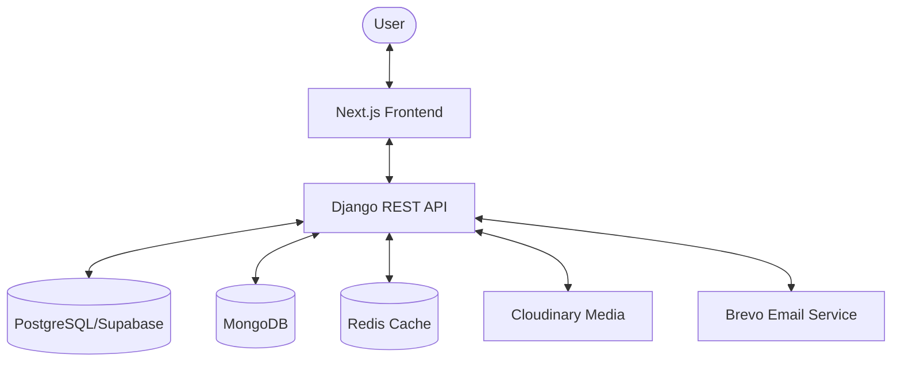

# SPEC.md — Project Specification (Current State)

> **Status**: `FINALIZED`
>
> **Project Name**: MrBikeBD
> **Description**: A comprehensive bike marketplace and news platform specifically tailored for the Bangladesh market.

---

## 1. Vision & Overview
MrBikeBD serves as a central hub for bike enthusiasts in Bangladesh, offering a marketplace for used bikes, detailed bike data (specifications, prices), news articles, and user interactions. The platform aims to provide a seamless experience for both buyers and sellers, integrated with modern security and performance standards.

## 2. Technology Stack

### 2.1 Backend (Python/Django)
- **Framework**: Django 4.2 with Django REST Framework (DRF).
- **Primary Database**: PostgreSQL (configured for Supabase).
- **Current Database Status**: Intelligent fallback to local **SQLite** (`db.sqlite3`) for development and when Supabase connection is unavailable.
- **Secondary Databases**: 
    - **MongoDB**: Used for flexible data storage (e.g., bike engine details, logging).
    - **SQLite**: Used for local development and fallback.
- **Cache & Message Broker**: Redis (with SSL handling).
- **Authentication**: JWT (SimpleJWT) with refresh token rotation and blacklisting. Google OAuth 2.0 also configured.
- **Media Storage**: Cloudinary (for image hosting and optimization).
- **Email Service**: Brevo (SMTP Relay) for user notifications and verification.
- **API Documentation**: Swagger/OpenAPI (via `drf-yasg`).
- **Web Server**: Gunicorn with WhiteNoise for static file serving.
- **Monitoring**: Sentry SDK configured for production.

### 2.2 Frontend (Next.js/React)
- **Framework**: Next.js 15+ (App Router).
- **React version**: 19.
- **Styling**: Tailwind CSS 4, Radix UI (Primitives), Framer Motion (Animations).
- **Icons**: Hugeicons React, Lucide React.
- **State Management**: Zustand (Client state), TanStack Query (Server state/caching).
- **Form Management**: React Hook Form with Zod validation.
- **Authentication**: NextAuth.js.
- **HTTP Client**: Axios.
- **UI Components**: Shadcn-like architecture using Radix UI components (Accordion, Dialog, Select, Select, etc.).

## 3. Architecture

### 3.1 Overall System Structure
The project follows a decoupled architecture with a Python/Django backend serving a RESTful API and a Next.js frontend consuming it.

### 3.2 Backend Components (`backend/apps/`)
- **`users`**: Custom user model, OTP handling (in debug), JWT authentication, and profile management.
- **`bikes`**: Comprehensive bike specifications, brand management, and model data.
- **`marketplace`**: Implementation of `UsedBikeListingViewSet` for managing and searching used bike advertisements.
- **`news`**: Editorial system for publishing articles, news, and managing drafts.
- **`interactions`**: Handling of social features such as comments and likes on articles or listings.
- **`recommendations`**: Logic for personalized bike suggestions.
- **`engine`**: Core processing logic for bike data and system utilities.
- **`editorial`**: Additional management tools for content creators.

### 3.3 Frontend Components (`frontend/src/`)
- **`app/`**: Next.js App Router pages and layouts.
- **`components/`**: Reusable UI components (buttons, cards, modals).
- **`hooks/`**: Custom React hooks for business logic and data fetching.
- **`lib/`**: Utility functions and API clients (Axios instance).
- **`providers/`**: Context providers (React Query, NextAuth, Themes).
- **`store/`**: Zustand stores for global state.
- **`types/`**: TypeScript interfaces and types.

## 4. Key Configuration Files
- **Root**:
    - `.env.local`: Environment variables.
    - `package.json`: Basic scripts.
- **Backend (`backend/core/`)**:
    - `settings.py`: Main Django configuration.
    - `urls.py`: Root URL routing.
- **Frontend (`frontend/`)**:
    - `next.config.ts`: Next.js specific configuration (remote images, compiler settings).
    - `tsconfig.json`: TypeScript configuration.
    - `package.json`: Frontend-specific dependencies and scripts.

## 5. Deployment & Environment
- **Environment Management**: `.env` files across root, backend, and frontend.
- **Static Assets**: Handled by WhiteNoise on the backend and Next.js built-in features on the frontend.
- **CORS**: Configured in Django to allow frontend origins.

---

*Last updated: 2026-03-01*
